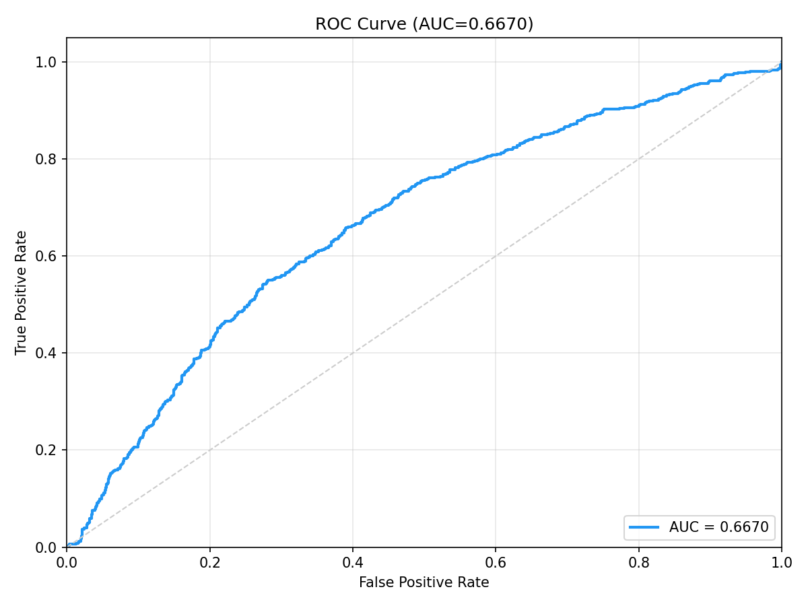
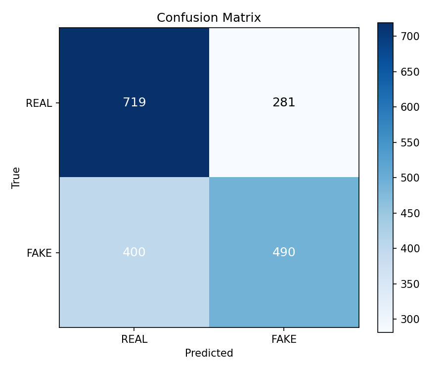

# Celeb-DF v2 Cross-Dataset Benchmark Raporu

**Model:** DeepfakeULTRA V5 (DF40 ile egitilmis)  
**Tarih:** 2026-05-13  
**Dataset:** Celeb-DF v2 (Li et al., CVPR 2020)

---

## Dataset Bilgisi

| Ozellik | Deger |
|---------|-------|
| Kaynak | Celeb-DF v2 (resmi ZIP, 9.5 GB) |
| Video Sayisi | 590 real + 5639 fake |
| Test Gorseli | **1,000 REAL + 890 FAKE = 1,890** |
| Frame Cikarma | Center-crop, 5 frame/video, 224x224 |
| Deepfake Yontemi | Autoencoder-based face swap |

---

## Performans Metrikleri

| Metrik | Deger |
|--------|-------|
| **ROC-AUC** | **0.5439** |
| **EER** | 0.4651 (threshold=0.2968) |
| **ECE** | 0.1694 |
| **FPR@95TPR** | 0.9340 (threshold=0.2678) |

### Karar Esikleri

| Esik Tipi | Threshold | Accuracy | Macro F1 |
|-----------|-----------|----------|----------|
| **Optimal (Youden J)** | 0.3209 (J=0.0833) | **0.5566** | **0.5162** |
| Sabit (0.5) | 0.5000 | 0.5212 | 0.3523 |

### Confusion Matrix (Optimal Threshold = 0.3209)

|  | Predicted REAL | Predicted FAKE |
|--|----------------|----------------|
| **Actual REAL** | 799 (TN) | 201 (FP) |
| **Actual FAKE** | 637 (FN) | 253 (TP) |

- **False Positive (FP):** 201 — gercek gorseller yanlis alarm
- **False Negative (FN):** 637 — deepfake'ler kaciriliyor

### Olasilik Dagilimi

| Sinif | Ortalama | Std |
|-------|----------|-----|
| REAL | 0.3107 | 0.0572 |
| FAKE | 0.3148 | 0.0529 |

> **Kritik Bulgu:** REAL ve FAKE olasilik ortalamalari neredeyse ayni (0.31 vs 0.31). Model bu deepfake turunu tanimiyamadi.

### Latency

| Metrik | Deger |
|--------|-------|
| Ortalama | 18.3 ms |
| Medyan | 18.1 ms |
| P95 | 22.9 ms |
| Cihaz | CUDA |

---

## Gorseller

### ROC Egrisi

### Confusion Matrix

---

## Sonuc

Celeb-DF v2 uzerinde **AUC=0.5439** — model bu dataset uzerinde rastgele tahmine yakin performans gosteriyor. Bunun temel nedeni:

1. **Yontem farki:** Celeb-DF eski nesil autoencoder face-swap kullaniyor, model ise modern diffusion-based yontemler (BlendFace, CollabDiff) ile egitildi
2. **Domain gap:** Celeb-DF'deki unlulerin gorsel kalitesi ve yuz ozellikleri egitim verisinden farkli
3. **Artifact farki:** Eski nesil deepfake'ler farkli artifact turleri uretiyor (blending boundary vs diffusion noise)
