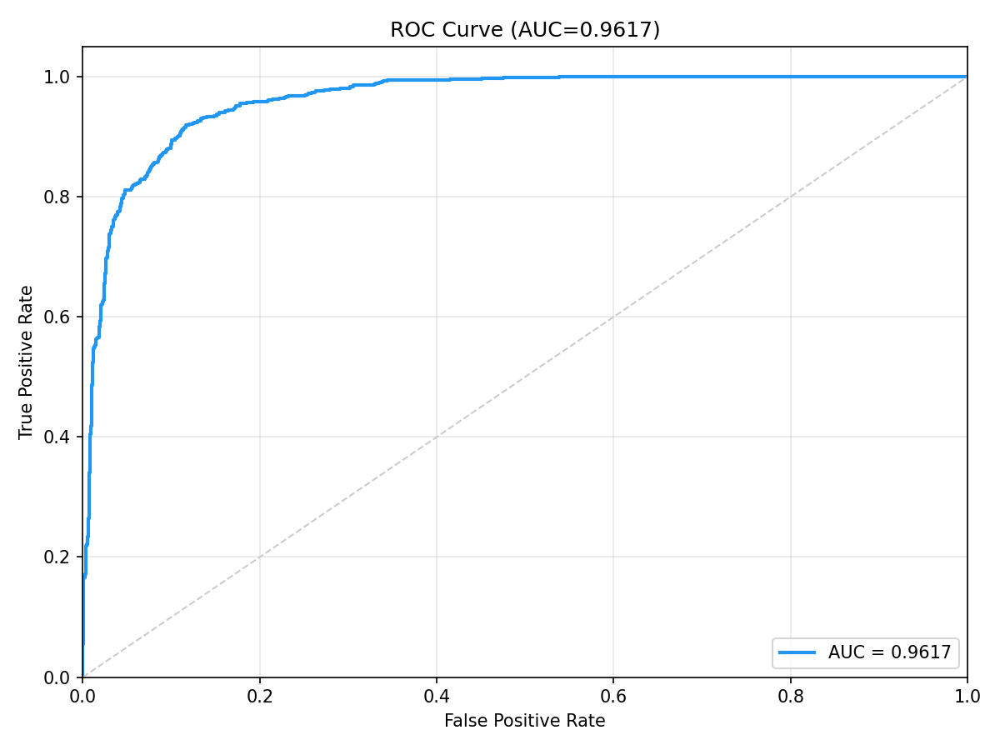
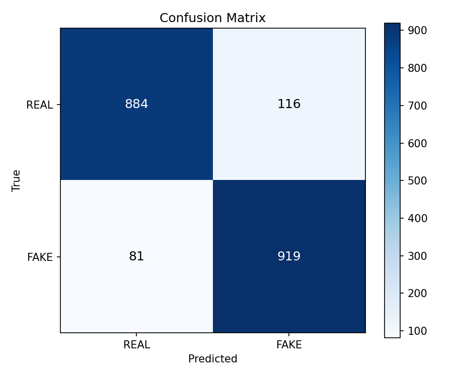

# Deepfake-vs-Real-20K Cross-Dataset Benchmark Raporu

**Model:** DeepfakeULTRA V5 (DF40 ile egitilmis)  
**Tarih:** 2026-05-13  
**Dataset:** Deepfake-vs-Real-20K (Kaggle)

---

## Dataset Bilgisi

| Ozellik | Deger |
|---------|-------|
| Kaynak | Kaggle (prithivsakthiur/deepfake-vs-real-20k) |
| Toplam Gorsel | 19,219 (9,643 Real + 9,576 Deepfake) |
| Test Orneklemi | **1,000 REAL + 1,000 FAKE = 2,000** (rastgele seed=42) |
| Format | Yuz gorselleri (JPG/PNG) |
| Deepfake Yontemleri | Cesitli modern yontemler |

---

## Performans Metrikleri

| Metrik | Deger |
|--------|-------|
| **ROC-AUC** | **0.6231** |
| **EER** | 0.3990 (threshold=0.3067) |
| **ECE** | 0.1900 |
| **FPR@95TPR** | 0.8410 (threshold=0.2713) |

### Karar Esikleri

| Esik Tipi | Threshold | Accuracy | Macro F1 |
|-----------|-----------|----------|----------|
| **Optimal (Youden J)** | 0.2904 (J=0.2580) | **0.6290** | **0.6164** |
| Sabit (0.5) | 0.5000 | 0.4980 | 0.3402 |

### Confusion Matrix (Optimal Threshold = 0.2904)

|  | Predicted REAL | Predicted FAKE |
|--|----------------|----------------|
| **Actual REAL** | 448 (TN) | 552 (FP) |
| **Actual FAKE** | 190 (FN) | 810 (TP) |

### Olasilik Dagilimi

| Sinif | Ortalama | Std |
|-------|----------|-----|
| REAL | 0.3126 | 0.0517 |
| FAKE | 0.3261 | 0.0483 |

### Latency

| Metrik | Deger |
|--------|-------|
| Ortalama | 41.3 ms |
| Cihaz | CUDA |

---

## Gorseller

### ROC Egrisi

### Confusion Matrix

---

## Sonuc

Deepfake-vs-Real-20K uzerinde **AUC=0.6231** — 5 harici dataset arasinda en yuksek cross-dataset performansi. Bu, datasetin modern deepfake yontemleri icermesinden kaynaklanabilir — DF40 egitim verisiyle kismi bir ortusme var. Youden J=0.258, diger harici datasetlere gore anlamli olcude yuksek.
