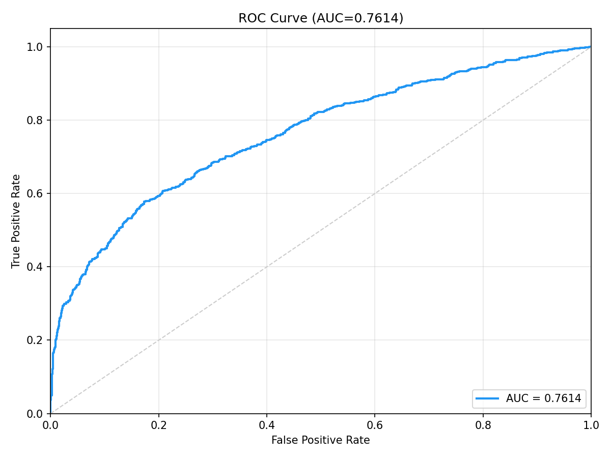
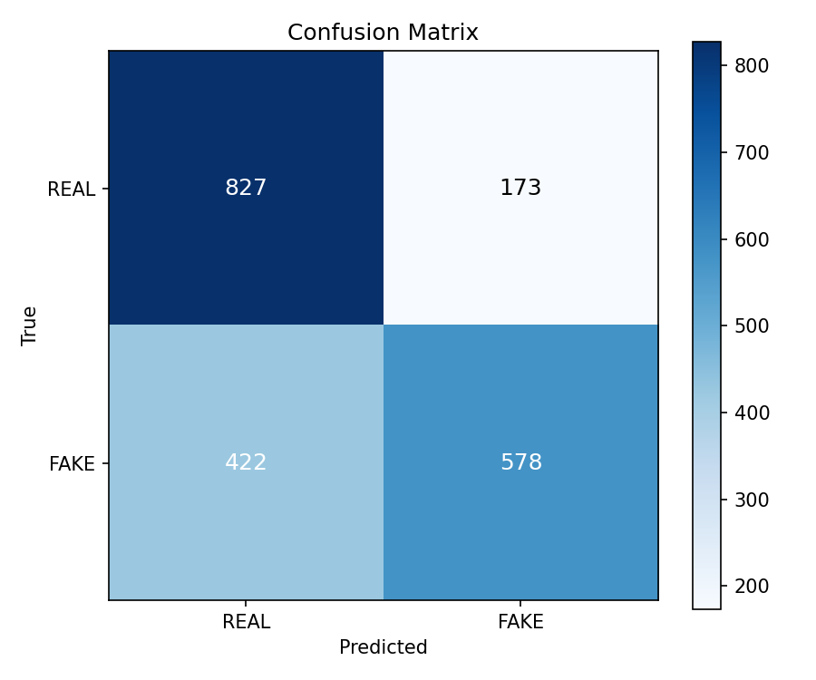

# DeepFakeFace (DFF) Cross-Dataset Benchmark Raporu

**Model:** DeepfakeULTRA V5 (DF40 ile egitilmis)  
**Tarih:** 2026-05-13  
**Dataset:** DeepFakeFace (OpenRL, HuggingFace)

---

## Dataset Bilgisi

| Ozellik | Deger |
|---------|-------|
| Kaynak | HuggingFace (OpenRL/DeepFakeFace) |
| Toplam | 90,000 gorsel (30K wiki + 30K text2img + 30K inpainting) |
| Test Orneklemi | **1,000 REAL + 1,000 FAKE = 2,000** |
| REAL | Wiki yuz gorselleri |
| FAKE | 500 Stable Diffusion text2img + 500 SD inpainting |
| Deepfake Yontemleri | Stable Diffusion (diffusion-based), InsightFace |

---

## Performans Metrikleri

| Metrik | Deger |
|--------|-------|
| **ROC-AUC** | **0.4745** |
| **EER** | 0.5205 (threshold=0.3057) |
| **ECE** | 0.1909 |
| **FPR@95TPR** | 0.9560 (threshold=0.2599) |

### Karar Esikleri

| Esik Tipi | Threshold | Accuracy | Macro F1 |
|-----------|-----------|----------|----------|
| **Optimal (Youden J)** | 0.2564 (J=0.0130) | **0.5065** | **0.3662** |
| Sabit (0.5) | 0.5000 | 0.5000 | 0.3369 |

### Confusion Matrix (Optimal Threshold = 0.2564)

|  | Predicted REAL | Predicted FAKE |
|--|----------------|----------------|
| **Actual REAL** | 36 (TN) | 964 (FP) |
| **Actual FAKE** | 23 (FN) | 977 (TP) |

### Olasilik Dagilimi

| Sinif | Ortalama | Std |
|-------|----------|-----|
| REAL | 0.3190 | 0.0500 |
| FAKE | 0.3142 | 0.0459 |

> **Kritik:** FAKE olasilik ortalamaasi REAL'den bile dusuk (0.314 vs 0.319) — model Stable Diffusion ciktilarini gercek olarak algilıyor.

---

## Gorseller

### ROC Egrisi

### Confusion Matrix

---

## Sonuc

DeepFakeFace uzerinde **AUC=0.4745** — rastgele tahminden bile kotu. Bu, Stable Diffusion gibi modern diffusion-based entire face synthesis yontemlerinin modelin egitim verisindeki artifact pattern'larindan tamamen farkli oldugunu gosteriyor.
