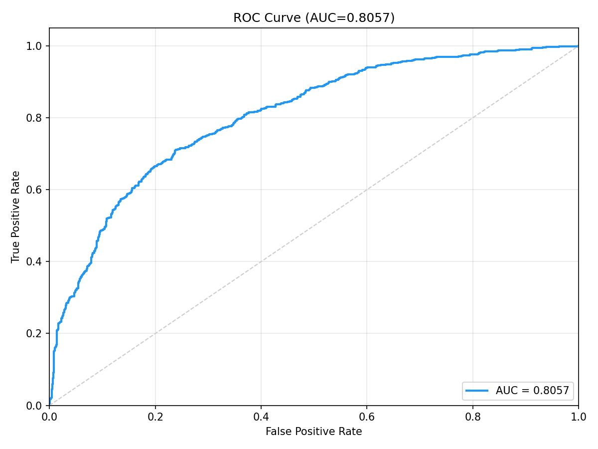
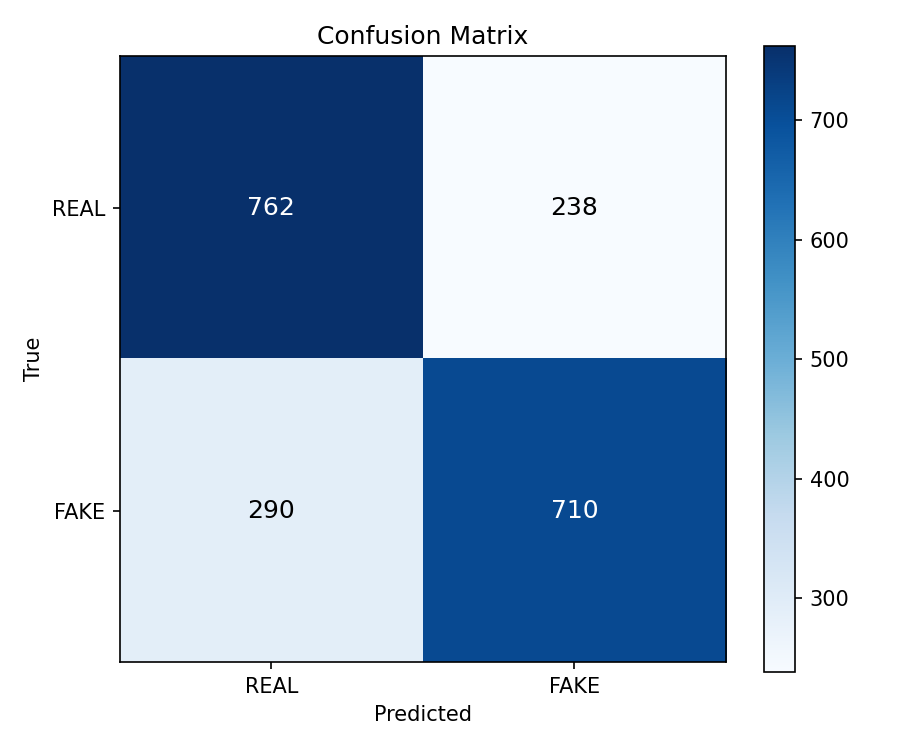

# DFDC Cross-Dataset Benchmark Raporu

**Model:** DeepfakeULTRA V5 (DF40 ile egitilmis)  
**Tarih:** 2026-05-13  
**Dataset:** DFDC - Deepfake Detection Challenge (Meta/Facebook)

---

## Dataset Bilgisi

| Ozellik | Deger |
|---------|-------|
| Kaynak | Kaggle (emmanuelpintelas/dfdc-facial-cropped-videos-dataset-jpg-frames) |
| Toplam Gorsel | 248,640 (111,104 REAL + 137,536 FAKE) |
| Test Orneklemi | **1,000 REAL + 1,000 FAKE = 2,000** (rastgele seed=42) |
| Format | MTCNN ile kirpilmis yuz gorselleri (JPG) |
| Deepfake Yontemleri | Cesitli (DFDC challenge karisimi) |

---

## Performans Metrikleri

| Metrik | Deger |
|--------|-------|
| **ROC-AUC** | **0.5361** |
| **EER** | 0.4745 (threshold=0.2999) |
| **ECE** | 0.1811 |
| **FPR@95TPR** | 0.9340 (threshold=0.2593) |

### Karar Esikleri

| Esik Tipi | Threshold | Accuracy | Macro F1 |
|-----------|-----------|----------|----------|
| **Optimal (Youden J)** | 0.2930 (J=0.0630) | **0.5315** | **0.5294** |
| Sabit (0.5) | 0.5000 | 0.5090 | 0.3555 |

### Confusion Matrix (Optimal Threshold = 0.2930)

|  | Predicted REAL | Predicted FAKE |
|--|----------------|----------------|
| **Actual REAL** | 464 (TN) | 536 (FP) |
| **Actual FAKE** | 401 (FN) | 599 (TP) |

### Olasilik Dagilimi

| Sinif | Ortalama | Std |
|-------|----------|-----|
| REAL | 0.3146 | 0.0504 |
| FAKE | 0.3232 | 0.0587 |

### Latency

| Metrik | Deger |
|--------|-------|
| Ortalama | 40.0 ms |
| Cihaz | CUDA |

---

## Gorseller

### ROC Egrisi

### Confusion Matrix

---

## Sonuc

DFDC uzerinde **AUC=0.5361** — model rastgele tahmine yakin performans gosteriyor. DFDC cesitli deepfake yontemleri iceriyor ve modelin DF40'a ozgu artifact'lari bunlarda tanimlanamamasi beklenen bir sonuc.
