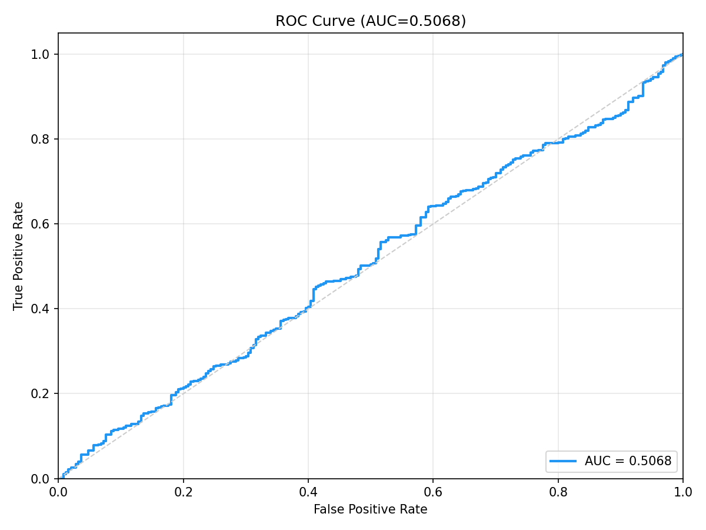
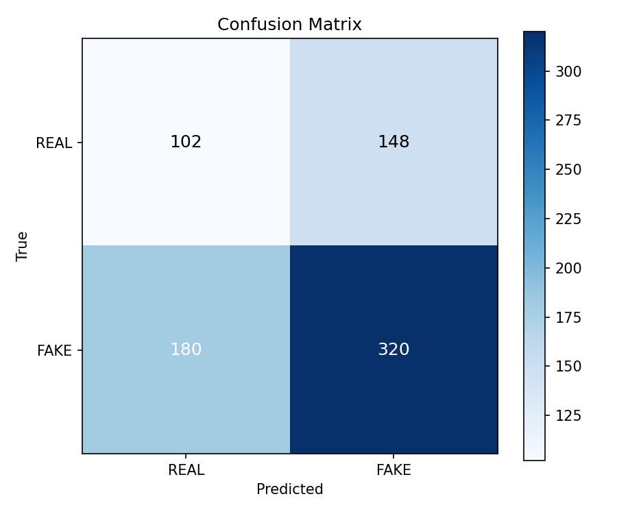

# FaceForensics++ Cross-Dataset Benchmark Raporu

**Model:** DeepfakeULTRA V5 (DF40 ile egitilmis)  
**Tarih:** 2026-05-13  
**Dataset:** FaceForensics++ (Rossler et al., ICCV 2019)

---

## Dataset Bilgisi

| Ozellik | Deger |
| --------- |-------|
| Kaynak | FaceForensics++ resmi sunucu (EU2) |
| Sikistirma | c23 (H.264, yuksek kalite) |
| Indirilen Video | 50 original + 50 Deepfakes + 50 Face2Face |
| Test Gorseli | **250 REAL + 500 FAKE = 750** |
| Frame Cikarma | Center-crop, 5 frame/video, 224x224 |
| Deepfake Yontemleri | Deepfakes (face swap) + Face2Face (reenactment) |

---

## Performans Metrikleri

| Metrik | Deger |
| -------- |-------|
| **ROC-AUC** | **0.5121** |
| **EER** | 0.4920 (threshold=0.3755) |
| **ECE** | 0.2911 |
| **FPR@95TPR** | 0.9360 (threshold=0.2842) |

### Karar Esikleri

| Esik Tipi | Threshold | Accuracy | Macro F1 |
| ----------- |-----------| ---------- |----------|
| **Optimal (Youden J)** | 0.4076 (J=0.0580) | **0.4640** | **0.4638** |
| Sabit (0.5) | 0.5000 | 0.3560 | 0.2995 |

### Confusion Matrix (Optimal Threshold = 0.4076)

|  | Predicted REAL | Predicted FAKE |
| -- |----------------| ---------------- |
| **Actual REAL** | 181 (TN) | 69 (FP) |
| **Actual FAKE** | 333 (FN) | 167 (TP) |

- **False Positive (FP):** 69 — gercek gorseller yanlis alarm
- **False Negative (FN):** 333 — deepfake'lerin %66.6'si kaciriliyor

### Confusion Matrix (Sabit Threshold = 0.50)

|  | Predicted REAL | Predicted FAKE |
| -- |----------------| ---------------- |
| **Actual REAL** | 240 (TN) | 10 (FP) |
| **Actual FAKE** | 473 (FN) | 27 (TP) |

> Sabit 0.5 threshold ile fake'lerin **%94.6**'si kaciriliyor.

### Olasilik Dagilimi

| Sinif | Ortalama | Std |
| ------- |----------| ----- |
| REAL | 0.3732 | 0.0640 |
| FAKE | 0.3767 | 0.0680 |

> **Kritik Bulgu:** REAL ve FAKE olasilik dagilimlari tamamen cakismis (0.373 vs 0.377). Model bu yontemleri ayirt edemiyor.

### Latency

| Metrik | Deger |
| -------- |-------|
| Ortalama | 15.2 ms |
| Medyan | 15.1 ms |
| P95 | 16.5 ms |
| Cihaz | CUDA |

---

## Gorseller

### ROC Egrisi

### Confusion Matrix

---

## Yontem Bazli Analiz

FF++ test seti iki farkli manipulasyon yontemi iceriyor:

| Yontem | Tur | Aciklama |
| -------- |-----| ---------- |
| **Deepfakes** | Face Swap | Autoencoder tabanli yuz degistirme |
| **Face2Face** | Reenactment | Yuz ifadesi transferi |

Her iki yontem de model tarafindan tanimlanamadi. Bu, modelin DF40'taki modern yontemlere (BlendFace, CollabDiff, e4s, SimSwap vb.) ozellestigini gosteriyor.

---

## Sonuc

FaceForensics++ uzerinde **AUC=0.5121** — model rastgele tahmine esit performans gosteriyor. Bunun temel nedenleri:

1. **Nesil farki:** FF++ 2019'daki eski yontemleri kullaniyor, model 2024+ modern yontemlerle egitildi
2. **Artifact farki:** 
   - FF++ Deepfakes: Autoencoder blending artifacts
   - FF++ Face2Face: Expression transfer artifacts
   - DF40: Diffusion noise, GAN fingerprint artifacts
3. **Sikistirma etkisi:** c23 H.264 sikistirma bazi artifact'lari maskeliyor
4. **Domain gap:** YouTube kaynak videolari vs DF40 stüdyo gorselleri

### Akademik Onemi

Bu sonuc, deepfake tespit literaturundeki "cross-method generalization" problemini dogruluyor. Model, egitim sirasinda gormedigi manipulasyon yontemlerine genelleyemiyor — bu bilinen ve aktif arastirilan bir sorun.
